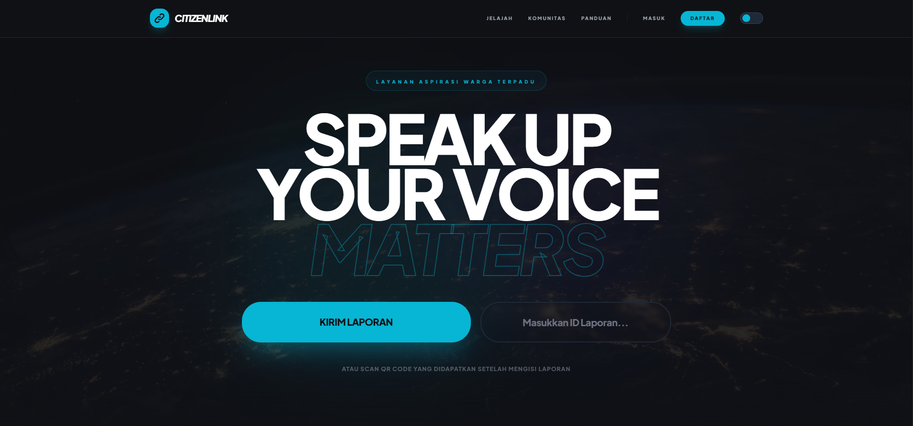
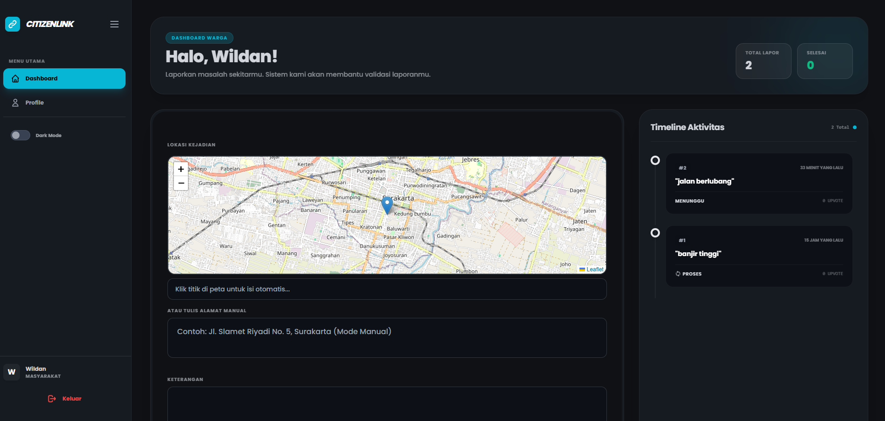
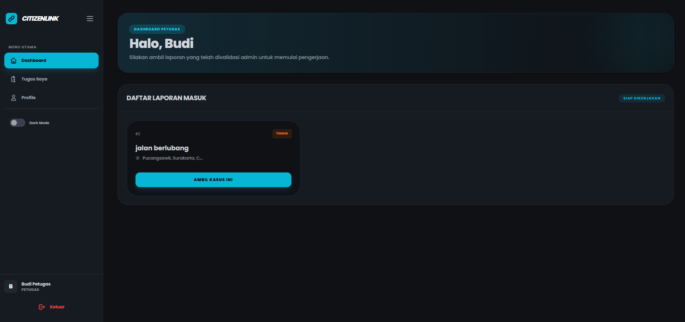
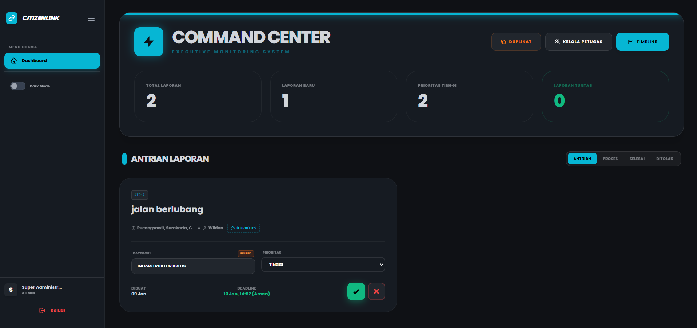
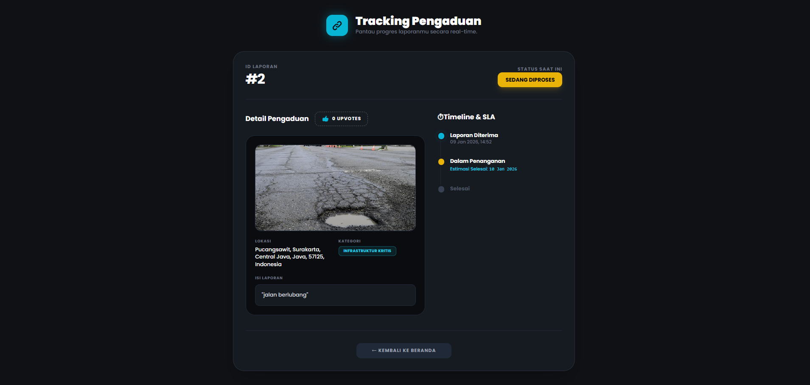

CITIZENLINK
Digital Citizen Aspiration & Public Complaint Management System

CitizenLink adalah aplikasi web pengaduan masyarakat berbasis Laravel yang memungkinkan warga melaporkan permasalahan publik secara cepat, transparan, dan terstruktur. Sistem ini dirancang dengan pendekatan smart system berbasis logika internal tanpa ketergantungan API AI berbayar.

Tujuan utama sistem ini adalah meningkatkan kualitas pengelolaan pengaduan publik melalui validasi data, prioritisasi berbasis komunitas, dan transparansi proses penanganan.

FITUR UTAMA

- Smart Duplicate Checker (3-Tahap Similarity)
  Mendeteksi dan mencegah laporan ganda dengan mengombinasikan kemiripan teks, pencocokan lokasi, dan kesamaan kategori laporan.

- Upvote-Based Priority System
  Prioritas penanganan laporan ditentukan secara dinamis berdasarkan jumlah dukungan warga.

- Smart Dispatch dan Kategorisasi
  Sistem mengklasifikasikan laporan ke kategori dan prioritas awal menggunakan aturan berbasis kata kunci dan SLA.

- SLA dan Timeline Tracking
  Monitoring tenggat waktu penanganan laporan dengan indikator status visual yang jelas.

- Public Tracking Tanpa Login
  Pelaporan dapat dilacak secara publik menggunakan ID unik atau QR Code tanpa perlu autentikasi.

- Evidence Upload dan Validation
  Mendukung unggahan foto bukti laporan serta bukti penyelesaian oleh petugas.

- Admin Command Center
  Dashboard terpusat untuk memantau status laporan, prioritas, dan performa petugas.

SMART SYSTEM OVERVIEW

CitizenLink menggunakan pendekatan algoritmik yang efisien dan ringan:

1. Text Similarity Engine
   Menggunakan similar_text() dan token matching untuk menghitung tingkat kemiripan laporan.

2. Location Matching
   Menganalisis irisan kata pada lokasi laporan untuk mendeteksi kejadian di area yang sama.

3. Rule-Based SLA Engine
   Penentuan tenggat waktu otomatis dan eskalasi prioritas (Darurat, Tinggi, Sedang, Rendah) yang dikonfigurasi secara dinamis melalui database.

4. Community Validation
   Sistem upvote digunakan sebagai sinyal validasi urgensi dari masyarakat.

TECH STACK

- Backend: Laravel 11 (PHP 8.2+)
- Frontend: Blade Templates, Tailwind CSS
- Interactivity: Alpine.js
- Database: MySQL
- Map Integration: Leaflet JS dan OpenStreetMap
- Storage: Laravel Storage

User Interface Preview

Landing Page – Public Access

Citizen Dashboard – Report Timeline
(Timeline aktivitas laporan warga)

Officer Dashboard – Task,Status,SLA
(Daftar tugas, status penanganan, bukti penyelesaian, SLA)

Admin Command Center – Monitoring & Control
(Overview sistem, prioritas&validasi, SLA Monitoring, duplikat)

Public Report Tracking
(Pelacakan laporan tanpa login)

STRUKTUR DIREKTORI UTAMA

app/
  Http/Controllers/LaporanController.php
  Models/Laporan.php
  Models/LaporanDukungan.php

resources/
  views/
    dashboard_parts/
    laporan/
    welcome.blade.php

routes/
  web.php

INSTALASI LOKAL

Ikuti langkah berikut untuk menjalankan aplikasi di komputer lokal:

1. Clone Repository
   git clone https://github.com/r1enc/CitizenLink.git
   cd CitizenLink

2. Install Dependency
   composer install
   npm install && npm run build

3. Setup Environment
   cp .env.example .env
   php artisan key:generate

4. Konfigurasi Database (.env)
   Pastikan file .env memiliki konfigurasi berikut:
   
   APP_NAME=CitizenLink
   APP_URL=http://localhost:8000
   
   DB_CONNECTION=mysql
   DB_HOST=127.0.0.1
   DB_PORT=3306
   DB_DATABASE=citizenlink
   DB_USERNAME=root
   DB_PASSWORD=

5. Migrasi dan Seeding
   php artisan migrate:fresh --seed
   php artisan storage:link

6. Jalankan Server
   php artisan serve

Akses aplikasi melalui browser di http://localhost:8000

STATUS PENGEMBANGAN

- Tahap: Prototype / MVP
- Pendekatan: Rule-based system tanpa API AI berbayar
- Fokus: Akurasi logika, efisiensi sistem, dan skalabilitas

ROADMAP

- Auto SLA Escalation dengan notifikasi
- Sentiment analysis laporan warga
- Advanced GIS visualization (heatmap)
- Public analytics dashboard

AUTHOR

Wildan Ariel
Informatics Student | Web Developer
GitHub: https://github.com/r1enc